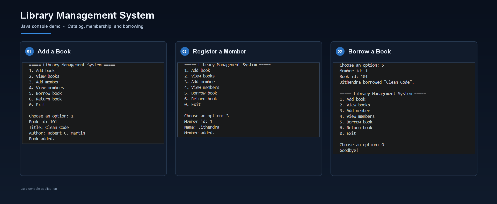

# Library Management System

A lightweight Java console application for managing a small library catalog and its members. It supports adding and listing books and members, borrowing and returning books, and enforces a three-book borrowing limit per member.

## Demo

## Features

- Add books and prevent duplicate book IDs
- Add members and prevent duplicate member IDs
- List the current books and members
- Borrow and return books while keeping each member's borrowed-book list in sync
- Limit each member to three borrowed books at a time
- Validate numeric menu choices and IDs
- Keep the catalog and member data in memory for the current run

## Requirements

- Java Development Kit (JDK) 17 or later

Check that Java and the compiler are available:

~~~text
java -version
javac -version
~~~

## Build and run

Run these commands from the repository root so the compiler can resolve the model and service packages.

### Windows PowerShell

~~~powershell
New-Item -ItemType Directory -Force out | Out-Null
javac -d out src/Main.java src/model/Book.java src/model/Library.java src/model/Member.java src/service/LibraryService.java
java -cp out Main
~~~

### macOS or Linux

~~~sh
mkdir -p out
javac -d out src/Main.java src/model/Book.java src/model/Library.java src/model/Member.java src/service/LibraryService.java
java -cp out Main
~~~

The compiled classes are written to out/, which is excluded from version control. The project has no external dependencies.

## Use

Start the program and choose an option from the menu. Add a book and a member before borrowing. Enter the member ID and book ID when prompted to borrow or return a book. Select 0 to exit.

All data is held in memory and is cleared when the program exits.

## Project structure

~~~text
src/
├── Main.java                 # Console menu and input handling
├── model/
│   ├── Book.java              # Book data and availability
│   ├── Library.java           # Book catalog operations
│   └── Member.java            # Member data and borrowed books
└── service/
    └── LibraryService.java   # Coordinates catalog and member operations
~~~

The source root is src/. The model package contains the domain classes, and service.LibraryService coordinates operations between the catalog and members.
## Future Improvements

- Add PostgreSQL database
- Build REST APIs using Spring Boot
- Add user authentication
- Add a web interface
- Add borrowing history
- Add due dates and fine calculation
## Author

Pulibandla Jithendra Venkata Siva Sai
